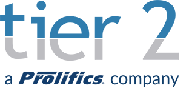

# Tier 2 Consulting Blogs - Angular Series - Control Flow  

This repository shows an example of how to use control flows that were introduced as a feature in Angular 17.

See [the blog post](https://www.tier2consulting.com/news-events/angular-showcase-control-flow/) for more details.
